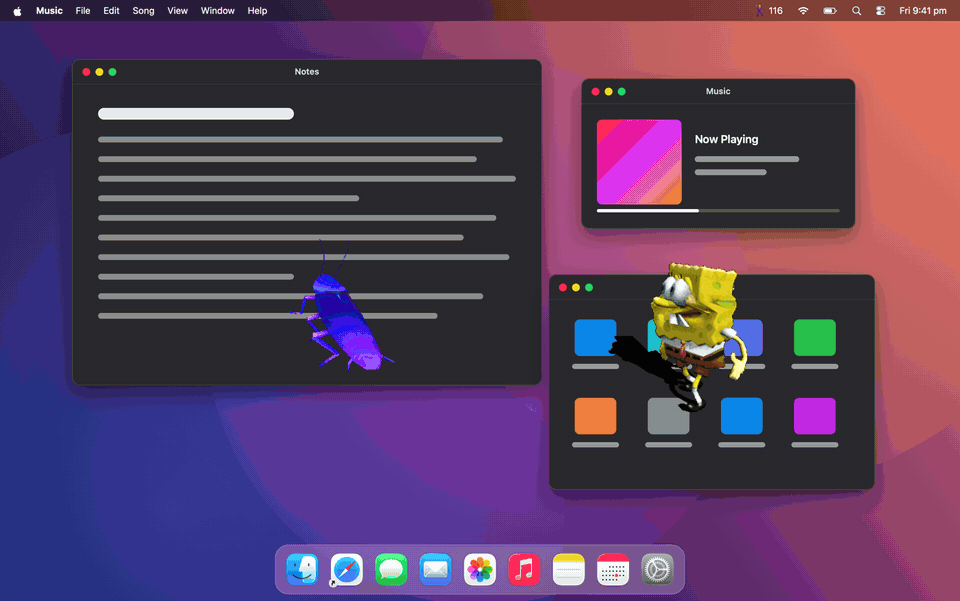

# Dancefloor

Dancing GIFs that float over your Mac and dance to the beat of whatever is playing.



A menu bar app. It listens to your Mac's audio output (Spotify, YouTube, Apple Music, anything),
works out the tempo and where the bars start, and times each GIF's loop so the dancers move on
the beat. Audio is analysed live on your Mac and is never recorded, saved or sent anywhere.

## Requirements

- macOS 15 or later (system audio capture uses Core Audio process taps)
- Xcode 16 or later, for the Swift 6 toolchain
- A free GIPHY API key for searching GIFs (optional: without one, Dancefloor uses GIFs from
  `~/Pictures/Dancefloor`)

## Install

```bash
git clone https://github.com/natesute/dancefloor.git
cd dancefloor
Scripts/install.sh
```

This builds the app, copies it to `/Applications/Dancefloor.app` and launches it.

1. When macOS asks, allow Dancefloor to capture audio. If you miss the prompt, allow it under
   System Settings → Privacy & Security → Audio Recording.
2. Get a GIPHY key: create an app at [developers.giphy.com](https://developers.giphy.com/),
   choose **API** (not SDK), and paste the key into Dancefloor's picker.
3. Optional: turn on **Open at login** in ⚙.

The build script signs with your Apple Development certificate if you have one. Without one it
signs ad hoc, which works but makes macOS ask for audio permission again after each rebuild.

## Using it

- **Click 🕺** in the menu bar to open the picker: search GIPHY, tap a search chip, or browse
  My folder. Click any GIF to add it as a dancer. Right-click a chip to remove it; **+** adds one.
  ⇄ randomises every dancer, ▤ saves and loads scenes (sets of dancers and positions), and ⚙
  has source, sync, hide, open at login, GIPHY key, folder and quit.
- **⌥⌘F** opens the picker at your pointer, from any app, including full screen.
- **⌥⌘D** hides or shows every dancer, from any app.
- **Speed is automatic**: each dancer loops over 1, 2, 4, 8… beats, whichever keeps it closest
  to the GIF's own speed (within about 1.4×). ½× and 2× shift from there; right-click → Automatic Speed resets.
- **Click a dancer** for its swap strip: hover an alternative to preview it on the dancer, click
  to swap. Below that: ½× / 2× speed, shift half a beat, ♥ keep in your folder, 🗑 remove.
- **Drag** a dancer to move it, **scroll** over it to resize, **right-click** for the full menu.
- **Sync** (⚙) nudges all dancers earlier or later if they look off the beat
  (Bluetooth headphones usually need them later).

Your GIF folder is `~/Pictures/Dancefloor`. Drop any GIF in there.
GIPHY needs a free API key from developers.giphy.com (Menu → Set GIPHY API Key…).

## How it works

- `SystemAudioTap` captures system audio with a Core Audio process tap. Nothing is saved.
- `BeatTracker` finds tempo from the autocorrelation of a spectral-flux onset envelope and
  beat phase from kick-weighted onsets. `BeatClock` smooths that into a continuous beat position.
- Bar starts: each estimate scores the four possible positions of beat 1 by kick strength and
  chord change (pitch-class shift) over the last 16 s; `BeatClock` takes a decaying vote so the
  dancers only move bar 1 when one position clearly wins. Loops then start on a downbeat.
- Each dancer maps bar position to a frame so one GIF loop spans N beats.

## Checking the beat tracker

```bash
swift test
swift run -c release bpmcheck path/to/song.mp3
swift run -c release bpmcheck --click 128
```

## Credits

GIF search is powered by [GIPHY](https://giphy.com). GIFs belong to their creators.

## License

[MIT](LICENSE)
